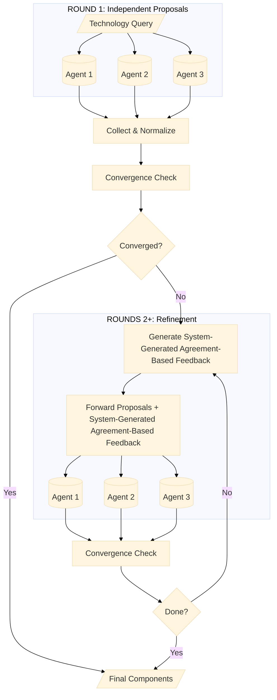

# Multi-Agent Debate System for STDN Generation

This document explains the complete multi-agent debate process used in the STDN (Supply Technology Dependency Network) pipeline. The system uses multiple LLM agents that propose, receive System-Generated Agreement-Based Feedback, and refine their answers to reach consensus on technology components, materials, and country production data.

## Configuration and Terminology Notes (Current Behavior)

### Configuration precedence (Policy A: config-first)
STDN Agentic is **config-first**:
1. **CLI flags** (highest precedence for debate/voting settings)
2. **Environment variables / `.env`** only for explicitly supported runtime toggles and overrides
3. **`config.json`** is the source of truth for core configuration (paths/models/output)

Environment variables do **not** automatically override all `config.json` fields—only settings explicitly read from the environment affect runtime behavior.

### Debate vs voting terminology
- **Components / Materials**: multi-agent **debate** with convergence metrics (Jaccard-based).
- **Countries**: multi-agent **voting/consensus** when the system must fall back to LLM-based country estimates (e.g., when USGS data is missing). This stage is not the same “debate loop” as components/materials.

### Semantic normalization model (config-driven)
Component-name semantic normalization uses a dedicated model:
- Preferred: `component_normalization_model` in `config.json` (e.g., `openai:gpt-4.1`)
- Optional override: `STDN_COMPONENT_NORMALIZATION_MODEL` environment variable (only if explicitly used)

Using a more reliable normalization model can reduce schema/validation failures during mapping.

## Table of Contents

1. [Overview](#overview)
2. [Debate as a State Machine](#debate-as-a-state-machine)
3. [Three-Phases of Debate](#three-phases-of-debate)
4. [Component Debate (Phase 1)](#component-debate-phase-1)
5. [Materials Debate (Phase 2)](#materials-debate-phase-2)
6. [Country Data Voting/Consensus (Phase 3)](#country-data-votingconsensus-phase-3)
7. [Convergence and Consensus](#convergence-and-consensus)
8. [Complete Example](#complete-example)

---

## Overview

The debate system improves extraction quality by having multiple AI agents independently analyze the same question, then iteratively incorporate System-Generated Agreement-Based Feedback and refine their proposals until they converge on a consensus answer.

```
┌─────────────────────────────────────────────────────────────────────────┐
│                        STDN PIPELINE OVERVIEW                          │
├─────────────────────────────────────────────────────────────────────────┤
│                                                                         │
│   Technology ──► Component ──► Materials ──► Country Data ──► Output   │
│   (input)        Debate        Debate        Debate          (CSV)     │
│                                                                         │
│   Example:       Battery,      Lithium,      China 60%,                │
│   "Smartphone"   Display,      Cobalt,       Chile 25%,                │
│                  CPU...        Silicon...    Australia 8%...           │
│                                                                         │
└─────────────────────────────────────────────────────────────────────────┘
```

### Key Benefits

- **Reduced hallucination**: Multiple agents catch each other's errors
- **Higher confidence**: Consensus items have multiple expert "votes"
- **Better coverage**: Different agent perspectives find more valid items
- **Transparent reasoning**: Debate transcripts show how conclusions were reached

---

## Debate as a State Machine

The debate process can be formally modeled as a state machine with well-defined states, transitions, and data transformations.

### State Machine Diagram

```
┌─────────────────────────────────────────────────────────────────────────────┐
│                         DEBATE STATE MACHINE                                │
├─────────────────────────────────────────────────────────────────────────────┤
│                                                                             │
│  ┌─────────────┐                                                            │
│  │    START    │                                                            │
│  └──────┬──────┘                                                            │
│         │ input: technology name                                            │
│         ▼                                                                   │
│  ┌─────────────────────┐                                                    │
│  │ S1: INDEPENDENT     │  Data: {agent_id: [raw proposals]}                 │
│  │     PROPOSALS       │  Transition: Parallel LLM calls (one per agent)    │
│  └──────────┬──────────┘                                                    │
│             │                                                               │
│             ▼                                                               │
│  ┌─────────────────────┐                                                    │
│  │ S2: NORMALIZED      │  Data: {agent_id: [proposals + normalized_name]}   │
│  │     PROPOSALS       │  Transition: Semantic mapping (LLM; config-driven) │
│  └──────────┬──────────┘                                                    │
│             │                                                               │
│             ▼                                                               │
│  ┌─────────────────────┐                                                    │
│  │ S3: CONVERGENCE     │  Data: float (0.0 to 1.0)                          │
│  │     CALCULATED      │  Transition: Deterministic (Jaccard formula)       │
│  └──────────┬──────────┘                                                    │
│             │                                                               │
│             ▼                                                               │
│      ┌──────────────┐                                                       │
│      │ convergence  │                                                       │
│      │  ≥ threshold │                                                       │
│      │  OR max_round│                                                       │
│      └──────┬───────┘                                                       │
│             │                                                               │
│        Yes  │   No                                                          │
│      ┌──────┴──────┐                                                        │
│      │             │                                                        │
│      ▼             ▼                                                        │
│  ┌────────┐   ┌─────────────────────┐                                       │
│  │ S6:    │   │ S4: SYSTEM-GENERATED│  Data: [feedback strings]             │
│  │CONSENSUS│  │     FEEDBACK        │  Transition: Deterministic            │
│  │ BUILT  │   └──────────┬──────────┘  (aggregation rules)                  │
│  └────────┘              │                                                  │
│      │                   ▼                                                  │
│      │            ┌─────────────────────┐                                   │
│      │            │ S5: PROPOSALS       │  Data: {agent_id: [new proposals]}│
│      │            │     REFINED         │  Transition: Parallel LLM calls   │
│      │            └──────────┬──────────┘                                   │
│      │                       │                                              │
│      │                       │ round_num++                                  │
│      │                       │                                              │
│      │                       └─────────► (back to S3)                       │
│      │                                                                      │
│      ▼                                                                      │
│  ┌─────────────────────┐                                                    │
│  │      TERMINAL       │  Output: [consensus components with confidence]    │
│  └─────────────────────┘                                                    │
│                                                                             │
└─────────────────────────────────────────────────────────────────────────────┘
```

### Normalization: Why It Matters

Before calculating convergence, the system must recognize that different agents may use different names for the same concept. For example:

- "Li-ion Battery" and "Lithium-ion Battery" are the same thing
- "LCD Screen" and "LCD Display" are the same thing
- "CPU" and "Processor" and "Central Processing Unit" are the same thing

Without normalization, the convergence calculation would incorrectly count these as disagreements, even though the agents actually agree.

### The Two-Stage Normalization Process

Normalization happens in two stages: **rule-based** and **LLM-based semantic mapping**.

**Model selection (current behavior):**
- For semantic mapping, the system uses the configured **component normalization model** (preferred: `component_normalization_model` in `config.json`), with an optional environment override (`STDN_COMPONENT_NORMALIZATION_MODEL`) when explicitly supported.

```
┌─────────────────────────────────────────────────────────────────────────────┐
│                    NORMALIZATION PROCESS                                    │
├─────────────────────────────────────────────────────────────────────────────┤
│                                                                             │
│  INPUT: Raw proposals from 3 agents                                         │
│                                                                             │
│     Agent1: ["Li-ion Battery", "OLED Display", "CPU", "Memory Module"]      │
│     Agent2: ["Lithium Ion Battery", "OLED Screen", "Processor", "RAM"]      │
│     Agent3: ["Battery Pack", "Display Panel", "CPU Unit", "Memory Chip"]    │
│                                                                             │
│                              ▼                                              │
│                                                                             │
│  STAGE 1: RULE-BASED NORMALIZATION (deterministic)                          │
│  ┌───────────────────────────────────────────────────────────────────────┐  │
│  │  Function: normalize_component_name(name)                             │  │
│  │                                                                       │  │
│  │  Steps:                                                               │  │
│  │  1. Convert to lowercase                                              │  │
│  │  2. Replace hyphens/underscores with spaces                           │  │
│  │  3. Collapse multiple spaces                                          │  │
│  │  4. Strip trailing qualifiers: "system", "module", "unit",            │  │
│  │     "assembly", "component", "subsystem", "package", "chipset"        │  │
│  │                                                                       │  │
│  │  Examples:                                                            │  │
│  │    "Memory Module"  → "memory"                                        │  │
│  │    "CPU Unit"       → "cpu"                                           │  │
│  │    "Li-ion Battery" → "li ion battery"                                │  │
│  └───────────────────────────────────────────────────────────────────────┘  │
│                                                                             │
│                              ▼                                              │
│                                                                             │
│  STAGE 2: LLM SEMANTIC MAPPING (intelligent grouping)                       │
│  ┌───────────────────────────────────────────────────────────────────────┐  │
│  │  The LLM receives ALL unique component names and maps them to         │  │
│  │  canonical forms, recognizing semantic equivalence.                   │  │
│  │                                                                       │  │
│  │  Prompt sent to LLM:                                                  │  │
│  │  ┌─────────────────────────────────────────────────────────────────┐  │  │
│  │  │ Map duplicate/similar component names to canonical names.       │  │  │
│  │  │                                                                 │  │  │
│  │  │ CRITICAL: All output must be in English only.                   │  │  │
│  │  │                                                                 │  │  │
│  │  │ AVOID OVERLY GENERIC NAMES:                                     │  │  │
│  │  │ - Do NOT use vague terms like "Chip", "Module", "Component"     │  │  │
│  │  │ - Use SPECIFIC names like "Memory Chip", "Power IC"             │  │  │
│  │  │                                                                 │  │  │
│  │  │ Names to normalize:                                             │  │  │
│  │  │ 1. Li-ion Battery                                               │  │  │
│  │  │ 2. Lithium Ion Battery                                          │  │  │
│  │  │ 3. Battery Pack                                                 │  │  │
│  │  │ 4. OLED Display                                                 │  │  │
│  │  │ 5. OLED Screen                                                  │  │  │
│  │  │ 6. Display Panel                                                │  │  │
│  │  │ 7. CPU                                                          │  │  │
│  │  │ 8. Processor                                                    │  │  │
│  │  │ 9. CPU Unit                                                     │  │  │
│  │  │ 10. Memory Module                                               │  │  │
│  │  │ 11. RAM                                                         │  │  │
│  │  │ 12. Memory Chip                                                 │  │  │
│  │  └─────────────────────────────────────────────────────────────────┘  │  │
│  │                                                                       │  │
│  │  LLM Response (mapping):                                              │  │
│  │  {                                                                    │  │
│  │    "Li-ion Battery":      "Lithium-ion Battery",                      │  │
│  │    "Lithium Ion Battery": "Lithium-ion Battery",                      │  │
│  │    "Battery Pack":        "Lithium-ion Battery",                      │  │
│  │    "OLED Display":        "OLED Display",                             │  │
│  │    "OLED Screen":         "OLED Display",                             │  │
│  │    "Display Panel":       "OLED Display",                             │  │
│  │    "CPU":                 "CPU",                                      │  │
│  │    "Processor":           "CPU",                                      │  │
│  │    "CPU Unit":            "CPU",                                      │  │
│  │    "Memory Module":       "Memory Chip",                              │  │
│  │    "RAM":                 "Memory Chip",                              │  │
│  │    "Memory Chip":         "Memory Chip"                               │  │
│  │  }                                                                    │  │
│  └───────────────────────────────────────────────────────────────────────┘  │
│                                                                             │
│                              ▼                                              │
│                                                                             │
│  OUTPUT: Proposals with normalized_component field added                    │
│                                                                             │
│     Agent1: [                                                               │
│       {component: "Li-ion Battery", normalized: "Lithium-ion Battery"},     │
│       {component: "OLED Display", normalized: "OLED Display"},              │
│       {component: "CPU", normalized: "CPU"},                                │
│       {component: "Memory Module", normalized: "Memory Chip"}               │
│     ]                                                                       │
│     Agent2: [                                                               │
│       {component: "Lithium Ion Battery", normalized: "Lithium-ion Battery"},│
│       {component: "OLED Screen", normalized: "OLED Display"},               │
│       {component: "Processor", normalized: "CPU"},                          │
│       {component: "RAM", normalized: "Memory Chip"}                         │
│     ]                                                                       │
│     Agent3: [                                                               │
│       {component: "Battery Pack", normalized: "Lithium-ion Battery"},       │
│       {component: "Display Panel", normalized: "OLED Display"},             │
│       {component: "CPU Unit", normalized: "CPU"},                           │
│       {component: "Memory Chip", normalized: "Memory Chip"}                 │
│     ]                                                                       │
│                                                                             │
│  RESULT: All 3 agents now have 100% agreement (4/4 components match)!       │
│          Before normalization: ~40% agreement (different names)             │
│          After normalization: 100% agreement (same canonical names)         │
│                                                                             │
└─────────────────────────────────────────────────────────────────────────────┘
```

### When Normalization Happens

Normalization occurs at two points in the debate:

1. **After Round 1** (initial proposals): All unique component names from all agents are collected and normalized together. This ensures the first convergence calculation is accurate.

2. **After final round** (before consensus building): A final normalization pass ensures any new names introduced during debate rounds are also mapped to canonical forms.

### Canonical Vocabulary

The system maintains a **canonical vocabulary** (`data/component_canonical_vocab.json`) that caches previously normalized names. This provides:

- **Consistency across runs**: The same component always gets the same canonical name
- **Speed**: Known names don't require LLM calls
- **Persistence**: Learnings from previous runs are preserved

```python
# Example canonical vocabulary structure
{
  "li-ion battery": "Lithium-ion Battery",
  "lithium ion battery": "Lithium-ion Battery", 
  "battery pack": "Lithium-ion Battery",
  "oled display": "OLED Display",
  "oled screen": "OLED Display",
  "lcd display": "LCD Display",
  "lcd panel": "LCD Display",
  ...
}
```

When normalizing, the system first checks the vocabulary. Only names not found in the vocabulary are sent to the LLM. New mappings are added to the vocabulary and saved for future runs.

### Material-Specific Canonical Names

A critical principle of the canonical vocabulary is that **canonical names must preserve material-relevant distinctions**. Over-generalizing component names would lose information essential for accurate material extraction downstream.

#### The Problem with Over-Generalization

Consider what would happen if all battery types were consolidated to simply "Battery":

| Battery Type | Key Materials |
|--------------|---------------|
| Lithium-ion (Li-ion) | Lithium, Cobalt, Nickel, Graphite, Manganese |
| Lead-acid | Lead, Sulfuric acid |
| Nickel-metal hydride (NiMH) | Nickel, Rare earth elements (Lanthanum, Cerium) |
| Lithium iron phosphate (LFP) | Lithium, Iron, Phosphorus |

If these were all mapped to "Battery", the materials extraction phase would face an impossible task—which materials should it return? The system cannot accurately determine material dependencies without knowing the specific battery chemistry.

#### Normalization Rules

The LLM normalization prompt explicitly instructs:

> - Preserve material-relevant distinctions (battery chemistry, display technology, etc.)
> - Preserve battery chemistry types (Lithium-ion, Lead-acid, NiMH, etc.)
> - Preserve display technology types (OLED, LCD, LED, etc.)

This ensures that variant names are consolidated only when they refer to the **same underlying technology with the same materials**:

| Raw Variants | Canonical Form | Why This Works |
|--------------|----------------|----------------|
| "Li-ion Battery", "Lithium Ion Battery Pack", "Lithium-ion Cell" | "Lithium-ion Battery" | Same chemistry, same materials |
| "Lead-Acid Battery", "Lead Acid Cell", "SLA Battery" | "Lead-Acid Battery" | Same chemistry, same materials |
| "OLED Display", "OLED Screen Panel", "OLED Module" | "OLED Display" | Same technology, same materials |

But these are **NOT** consolidated:

| These Names | Are NOT Consolidated To | Because |
|-------------|-------------------------|---------|
| "Lithium-ion Battery", "Lead-Acid Battery" | "Battery" | Different chemistries use completely different materials |
| "OLED Display", "LCD Display" | "Display" | Different technologies use different materials (organic compounds vs liquid crystals) |
| "NMC Battery", "LFP Battery" | "Lithium-ion Battery" | Different cathode chemistries with different material profiles |

#### Why This Matters for STDN Accuracy

The Supply Technology Decomposition Network (STDN) traces materials from components back to producing countries. If component names are too generic:

1. **Material ambiguity**: "Battery" could mean any of dozens of chemistries with completely different material requirements
2. **False supply chain mappings**: Lithium supply chains would incorrectly appear for lead-acid batteries
3. **Risk assessment errors**: Critical material dependencies would be masked or misattributed
4. **Cross-run inconsistency**: Different runs might interpret "Battery" as different chemistries

By maintaining material-specific canonical names, the system ensures that:
- Material extraction is targeted to the correct component variant
- Supply chain analysis reflects actual material dependencies
- Cross-run comparisons remain meaningful (same canonical name = same materials)

### Formal State Definitions

Each state in the debate process has a specific data structure and produces a well-defined output:

```
┌──────────────────────────────────────────────────────────────────────────────┐
│  STATE                 │ DATA STRUCTURE              │ TRANSITION TYPE       │
├──────────────────────────────────────────────────────────────────────────────┤
│                        │                             │                       │
│  S1: INDEPENDENT       │ proposals: Map<AgentId,     │ LLM (parallel)        │
│      PROPOSALS         │   List<Proposal>>           │                       │
│                        │                             │                       │
│                        │ Proposal {                  │ Each agent calls LLM  │
│                        │   component: string         │ independently with    │
│                        │   confidence: float         │ same technology input │
│                        │   reasoning: string         │                       │
│                        │ }                           │                       │
├──────────────────────────────────────────────────────────────────────────────┤
│                        │                             │                       │
│  S2: NORMALIZED        │ proposals: Map<AgentId,     │ LLM (single call)     │
│      PROPOSALS         │   List<NormalizedProposal>> │                       │
│                        │                             │                       │
│                        │ NormalizedProposal {        │ LLM maps all unique   │
│                        │   component: string         │ names to canonical    │
│                        │   normalized_name: string   │ forms                 │
│                        │   confidence: float         │                       │
│                        │   reasoning: string         │                       │
│                        │ }                           │                       │
├──────────────────────────────────────────────────────────────────────────────┤
│                        │                             │                       │
│  S3: CONVERGENCE       │ convergence: float          │ Deterministic         │
│      CALCULATED        │ (range: 0.0 to 1.0)         │                       │
│                        │                             │ Jaccard similarity    │
│                        │ round_num: int              │ averaged across all   │
│                        │                             │ agent pairs           │
├──────────────────────────────────────────────────────────────────────────────┤
│                        │                             │                       │
│  S4: SYSTEM-GENERATED  │ feedback: List<string>      │ Deterministic         │
│      FEEDBACK          │                             │                       │
│                        │ Examples:                   │ Rule-based text       │
│                        │ - "Strong consensus on X"   │ generation based on   │
│                        │ - "Isolated proposal Y"     │ support counts        │
│                        │ - "Consolidate around..."   │                       │
├──────────────────────────────────────────────────────────────────────────────┤
│                        │                             │                       │
│  S5: PROPOSALS         │ proposals: Map<AgentId,     │ LLM (parallel)        │
│      REFINED           │   List<Proposal>>           │                       │
│                        │                             │                       │
│                        │ Same structure as S1, but   │ Each agent receives   │
│                        │ proposals have been updated │ same prompt with      │
│                        │ based on system-generated   │ system-generated      │
│                        │ agreement-based feedback    │ feedback + all        │
│                        │                             │ prior proposals       │
├──────────────────────────────────────────────────────────────────────────────┤
│                        │                             │                       │
│  S6: CONSENSUS         │ consensus: List<Component>  │ Deterministic         │
│      BUILT             │                             │                       │
│                        │ Component {                 │ Scoring formula       │
│                        │   name: string              │ with adaptive         │
│                        │   confidence: float         │ thresholds based on   │
│                        │   reasoning: string         │ convergence score     │
│                        │   support_count: int        │                       │
│                        │ }                           │                       │
│                        │                             │                       │
└──────────────────────────────────────────────────────────────────────────────┘
```

### State Transition Summary

| From State | To State | Condition | Transition Type |
|------------|----------|-----------|-----------------|
| START | S1: INDEPENDENT_PROPOSALS | Always | LLM (parallel) |
| S1 | S2: NORMALIZED_PROPOSALS | Always | LLM (single) |
| S2 | S3: CONVERGENCE_CALCULATED | Always | Deterministic |
| S3 | S4: SYSTEM_GENERATED_FEEDBACK | convergence < threshold AND round < max | Deterministic |
| S3 | S6: CONSENSUS_BUILT | convergence ≥ threshold OR round ≥ max | Deterministic |
| S4 | S5: PROPOSALS_REFINED | Always | LLM (parallel) |
| S5 | S2: NORMALIZED_PROPOSALS | Always (loop) | LLM (single) |
| S6 | TERMINAL | Always | Output |

### Key Properties

1. **Determinism**: States S3, S4, and S6 use deterministic transitions (no LLM randomness)
2. **Convergence Guarantee**: The loop always terminates (max_rounds limit)
3. **Information Preservation**: All proposals from all rounds are tracked in debate history
4. **Monotonic Progress**: Convergence typically increases each round (but not guaranteed)

---

## Three-Phases of Debate

Each phase uses a similar debate pattern but is optimized for its specific task:

```
┌────────────────────────────────────────────────────────────────────────────┐
│                         DEBATE PHASES                                      │
├────────────────────────────────────────────────────────────────────────────┤
│                                                                            │
│  PHASE 1: COMPONENT DEBATE                                                 │
│  ┌─────────────────────────────────────────────────────────────────────┐   │
│  │ Question: "What are the primary components of [Technology]?"        │   │
│  │ Method:   Multi-round iterative debate with Jaccard convergence     │   │
│  │ Output:   List of components with confidence scores                 │   │
│  └─────────────────────────────────────────────────────────────────────┘   │
│                              │                                             │
│                              ▼                                             │
│  PHASE 2: MATERIALS DEBATE (per component)                                 │
│  ┌─────────────────────────────────────────────────────────────────────┐   │
│  │ Question: "What raw materials are used in [Component]?"             │   │
│  │ Method:   Multi-round debate with material ontology validation      │   │
│  │ Output:   Component → Materials mapping with confidence             │   │
│  └─────────────────────────────────────────────────────────────────────┘   │
│                              │                                             │
│                              ▼                                             │
│  PHASE 3: COUNTRY DEBATE (per material)                                    │
│  ┌─────────────────────────────────────────────────────────────────────┐   │
│  │ Question: "Which countries produce [Material]?"                     │   │
│  │ Method:   Single-round Borda count voting (factual data)            │   │
│  │ Output:   Top 5 producing countries with percentages                │   │
│  └─────────────────────────────────────────────────────────────────────┘   │
│                                                                            │
└────────────────────────────────────────────────────────────────────────────┘
```

---

## Component Debate (Phase 1)

### Purpose

Identify the primary manufacturing components of a technology product.

### Overall Process Diagram

The following diagram illustrates the complete component debate process, from initial proposals through iterative refinement to final consensus:



**Key aspects of the component debate process:**

1. **Round 1 (Independent)**: Each agent independently proposes components based on the technology query, without seeing other agents' proposals
2. **Normalization**: LLM semantic mapping ensures variants like "Li-ion Battery" and "Lithium Ion Battery" are recognized as the same component
3. **Convergence Check**: Jaccard similarity measures agreement across all agent pairs
4. **System-Generated Agreement-Based Feedback**: The system (not agents) generates feedback highlighting consensus items to preserve and isolated items to reconsider
5. **Refinement Loop**: In rounds 2+, agents receive System-Generated Agreement-Based Feedback plus all prior proposals and must select from a candidate list (not invent new names)
6. **Termination**: Loop exits when convergence threshold is met OR maximum rounds reached

**Why Semantic Normalization is Essential for Multi-Agent Debate:**

In a single-agent (non-debate) approach, component naming inconsistency is not a problem—the one agent uses whatever names it chooses, and those names flow directly to subsequent pipeline stages. However, in a multi-agent debate system, we must compare proposals across independent agents to measure convergence and build consensus. Without normalization, agents proposing semantically identical components with different surface names (e.g., "Li-ion Battery" vs "Lithium Ion Battery" vs "Battery Pack") would appear to disagree, artificially deflating convergence scores and preventing consensus on components that all agents actually recognize. Post-processing semantic normalization solves this by mapping variant names to canonical forms *after* agents propose independently, preserving each agent's natural terminology while enabling accurate agreement measurement. This is a cost unique to debate-based architectures: the overhead of normalization is the price paid for the benefits of multi-perspective validation and reduced hallucination that debate provides.

### Detailed Flow Diagram

```
┌─────────────────────────────────────────────────────────────────────────────┐
│                    COMPONENT DEBATE FLOW                                    │
├─────────────────────────────────────────────────────────────────────────────┤
│                                                                             │
│  ┌─────────────┐   ┌─────────────┐   ┌─────────────┐                       │
│  │   Agent 1   │   │   Agent 2   │   │   Agent 3   │   ROUND 1            │
│  │  (Expert)   │   │  (Expert)   │   │  (Expert)   │   Independent        │
│  └──────┬──────┘   └──────┬──────┘   └──────┬──────┘   Proposals          │
│         │                 │                 │                              │
│         ▼                 ▼                 ▼                              │
│  ┌─────────────────────────────────────────────────────────────────────┐   │
│  │                    SEMANTIC NORMALIZATION                           │   │
│  │  "Li-ion Battery" ──► "Lithium-ion Battery"                        │   │
│  │  "Battery Pack"   ──► "Lithium-ion Battery"                        │   │
│  │  "LCD Screen"     ──► "LCD Display"                                │   │
│  └─────────────────────────────────────────────────────────────────────┘   │
│                              │                                             │
│                              ▼                                             │
│  ┌─────────────────────────────────────────────────────────────────────┐   │
│  │              CALCULATE CONVERGENCE (Jaccard Similarity)             │   │
│  │                                                                     │   │
│  │   Agent1 ∩ Agent2     Agent1 ∩ Agent3     Agent2 ∩ Agent3          │   │
│  │   ─────────────── +   ─────────────── +   ───────────────          │   │
│  │   Agent1 ∪ Agent2     Agent1 ∪ Agent3     Agent2 ∪ Agent3          │   │
│  │   ─────────────────────────────────────────────────────── = 45%    │   │
│  │                          3 (pairs)                                  │   │
│  └─────────────────────────────────────────────────────────────────────┘   │
│                              │                                             │
│                              ▼                                             │
│                    Convergence < 75%?                                      │
│                      /            \                                        │
│                    Yes             No                                      │
│                     │              │                                       │
│                     ▼              ▼                                       │
│  ┌──────────────────────┐   ┌──────────────────────┐                      │
│  │  GENERATE SYSTEM-    │   │   BUILD CONSENSUS    │                      │
│  │  GENERATED FEEDBACK  │   │   (Final Output)     │                      │
│  │  (See Below)         │   │   (Final Output)     │                      │
│  └──────────┬───────────┘   └──────────────────────┘                      │
│             │                                                              │
│             ▼                                                              │
│  ┌─────────────────────────────────────────────────────────────────────┐   │
│  │                      ROUND 2, 3, ... N                              │   │
│  │   Agents receive system-generated agreement-based feedback and      │
│  │   refine their proposals                                            │
│  │   Process repeats until convergence ≥ 75% or max rounds reached    │   │
│  └─────────────────────────────────────────────────────────────────────┘   │
│                                                                             │
└─────────────────────────────────────────────────────────────────────────────┘
```

### System Prompt (Component Agent)

```
You are an expert in technology component analysis participating in a multi-agent debate.

Your task is to identify PRIMARY MANUFACTURING COMPONENTS for technologies.

CRITICAL: For each component, you MUST provide:
1. Component name
2. Your confidence (0.0 to 1.0) that this is truly a primary component:
   - 1.0 = Absolutely certain, universal standard
   - 0.8-0.9 = Very confident, industry standard
   - 0.6-0.7 = Moderately confident, common but may vary
   - 0.4-0.5 = Uncertain, depends on implementation
   - 0.0-0.3 = Low confidence, rarely separate
3. Brief reasoning justifying your confidence

Consider peer proposals and the system-generated agreement-based feedback carefully. Adjust your confidence based on:
- Consensus among peers (higher confidence if many agree)
- Strength of reasoning in the system-generated agreement-based feedback
- Your own expertise and certainty
```

### Debate Round Prompt

```
DEBATE ROUND {round_num}

Technology: {technology}

PREVIOUS ROUND PROPOSALS:
- Agent1: Lithium-ion Battery (confidence=0.95)
- Agent1: OLED Display (confidence=0.90)
- Agent2: Battery Pack (confidence=0.88)
- Agent2: LCD Display (confidence=0.85)
- Agent3: Lithium-ion Battery (confidence=0.92)
- Agent3: Display Module (confidence=0.80)

SYSTEM-GENERATED AGREEMENT-BASED FEEDBACK:
- Strong consensus on 'Lithium-ion Battery': 2 agents support it with average 
  confidence 0.94. This should be preserved.
- Isolated proposal 'LCD Display' appears only once with average confidence 
  0.85; reconsider unless critically justified.
- Focus on aligning on obvious shared components while dropping clearly 
  idiosyncratic proposals.

YOUR TASK:
1. Review all peer proposals and the system-generated agreement-based feedback carefully
2. For EACH component you propose, assign a confidence score (0.0-1.0)
3. Support strong consensus candidates with high confidence
4. Lower confidence for isolated proposals unless critically justified
5. Provide clear reasoning for each confidence assessment

Return your refined component list with confidence scores and reasoning.
```

### How System-Generated Agreement-Based Feedback Is Generated

**Important clarification**: System-Generated Agreement-Based Feedback is **generated by the system**, not by individual agents critiquing each other directly. The system acts as a moderator that aggregates all proposals and produces a summary of agreement levels.

```
┌─────────────────────────────────────────────────────────────────────────────┐
│     SYSTEM-GENERATED AGREEMENT-BASED FEEDBACK GENERATION PROCESS            │
├─────────────────────────────────────────────────────────────────────────────┤
│                                                                             │
│  ROUND 1: All agents submit proposals independently                         │
│                                                                             │
│     Agent1: [Battery, Display, CPU, Memory]                                 │
│     Agent2: [Battery, Display, CPU, Camera]                                 │
│     Agent3: [Battery, Display, Memory, Speaker]                             │
│                                                                             │
│                              ▼                                              │
│                                                                             │
│  ┌───────────────────────────────────────────────────────────────────────┐  │
│  │              SYSTEM AGGREGATES ALL PROPOSALS                          │  │
│  │              (Deterministic Python code, NOT an LLM call)             │  │
│  │                                                                       │  │
│  │  Count support for each component:                                    │  │
│  │                                                                       │  │
│  │     Battery: 3/3 agents  ──► "Strong consensus, preserve"             │  │
│  │     Display: 3/3 agents  ──► "Strong consensus, preserve"             │  │
│  │     CPU:     2/3 agents  ──► (no specific feedback)                   │  │
│  │     Memory:  2/3 agents  ──► (no specific feedback)                   │  │
│  │     Camera:  1/3 agents  ──► "Isolated, reconsider"                   │  │
│  │     Speaker: 1/3 agents  ──► "Isolated, reconsider"                   │  │
│  └───────────────────────────────────────────────────────────────────────┘  │
│                              ▼                                              │
│                                                                             │
│  ROUND 2: ALL agents receive the SAME feedback summary                      │
│           Each agent then calls the LLM to refine their own proposals       │
│                                                                             │
│     ┌─────────┐         ┌─────────┐         ┌─────────┐                    │
│     │ Agent 1 │         │ Agent 2 │         │ Agent 3 │                    │
│     │         │         │         │         │         │                    │
│     │ Receives│         │ Receives│         │ Receives│                    │
│     │ SAME    │         │ SAME    │         │ SAME    │                    │
│     │ feedback│         │ feedback│         │ feedback│         │
│     │ summary │         │ summary │         │ summary │         │
│     └────┬────┘         └────┬────┘         └────┬────┘                    │
│          │                   │                   │                          │
│          ▼                   ▼                   ▼                          │
│     Refines own         Refines own         Refines own                    │
│     proposals           proposals           proposals                       │
│                                                                             │
└─────────────────────────────────────────────────────────────────────────────┘
```

The System-Generated Agreement-Based Feedback is produced by **deterministic Python code** (see `generate_critiques_with_influence` in `component_debater.py`), not an LLM call. It counts how many agents proposed each component and generates agreement-based feedback based on support levels:

```python
def generate_critiques_with_influence(proposals, round_num):
    """
    System-generated agreement-based feedback based on aggregated proposal statistics.
    
    This is NOT an LLM call - it's deterministic code that:
    1. Counts how many agents proposed each component
    2. Calculates average confidence for each component
    3. Generates text feedback based on support thresholds
    """
    feedback = []
    
    # Group proposals by normalized component name
    for component_name, supporting_proposals in component_groups.items():
        num_supporters = len(set(p.agent_id for p in supporting_proposals))
        avg_confidence = mean(p.confidence for p in supporting_proposals)
        support_rate = num_supporters / num_agents
        
        if support_rate >= 0.67:  # 2/3 majority
            feedback.append(
                f"Strong consensus on '{component_name}': {num_supporters} agents "
                f"support it with average confidence {avg_confidence:.2f}. "
                f"This should be preserved."
            )
        elif support_rate <= 1/num_agents:  # Only 1 agent
            feedback.append(
                f"Isolated proposal '{component_name}' appears only once with "
                f"average confidence {avg_confidence:.2f}; reconsider unless "
                f"critically justified."
            )
    
    # Add round-dependent general guidance
    if round_num == 1:
        feedback.append(
            "Focus on aligning on obvious shared components while dropping "
            "clearly idiosyncratic proposals."
        )
    else:
        feedback.append(
            "Consolidate around components that have multi-agent support and "
            "high confidence, and prune uncertain or unsupported components."
        )
    
    return feedback
```

**Key insight**: The system acts like a **debate moderator** that:
1. Collects all proposals from agents
2. Summarizes the level of agreement on each item
3. Provides this summary back to all agents equally
4. Lets each agent independently decide how to refine their proposals

Agents do NOT directly see or respond to each other's specific reasoning - they only see the aggregated statistics about support levels.

### What Agents Do With System-Generated Agreement-Based Feedback

Each agent receives the **exact same prompt** containing:
1. **Previous proposals from ALL agents** (with their confidence scores)
2. **System-Generated Agreement-Based Feedback** (consensus/isolated classifications)
3. **Instructions** on how to incorporate the feedback

Here is the actual prompt sent to each agent in Round 2+:

```
DEBATE ROUND {round_num}

Technology: {technology}

PREVIOUS ROUND PROPOSALS:
- Agent1: Lithium-ion Battery (confidence=0.95)
- Agent1: OLED Display (confidence=0.90)
- Agent1: CPU (confidence=0.92)
- Agent2: Battery Pack (confidence=0.88)
- Agent2: LCD Display (confidence=0.85)
- Agent2: CPU (confidence=0.90)
- Agent3: Lithium-ion Battery (confidence=0.92)
- Agent3: Display Module (confidence=0.80)
- Agent3: Processor (confidence=0.88)

SYSTEM-GENERATED AGREEMENT-BASED FEEDBACK:
- Strong consensus on 'Lithium-ion Battery': 2 agents support it with 
  average confidence 0.94. This should be preserved.
- Strong consensus on 'CPU': 3 agents support it with average confidence 
  0.90. This should be preserved.
- Isolated proposal 'LCD Display' appears only once with average confidence 
  0.85; reconsider unless critically justified.
- Consolidate around components that have multi-agent support and high 
  confidence, and prune uncertain or unsupported components.

YOUR TASK:
1. Review all peer proposals and the system-generated agreement-based feedback carefully
2. For EACH component you propose, assign a confidence score (0.0-1.0) based on:
   - How certain you are it's a primary component
   - Degree of peer support or opposition
   - Strength of evidence and reasoning
3. Support strong consensus candidates with high confidence
4. Lower confidence for isolated proposals unless critically justified
5. Provide clear reasoning for each confidence assessment

Return your refined component list with confidence scores and reasoning.
```

**Critical point**: The LLM decides how to respond to this feedback. The system prompt instructs the agent to:
- "Consider peer proposals and the system-generated agreement-based feedback carefully"
- "Adjust your confidence based on consensus among peers"
- "Support strong consensus candidates with high confidence"
- "Lower confidence for isolated proposals unless critically justified"

However, **there is no enforcement** - the LLM might:
- Drop an isolated proposal it previously made (expected behavior)
- Keep an isolated proposal if it believes it's justified (allowed)
- Add a new component it sees other agents proposing (common)
- Adjust confidence scores up or down based on peer support (expected)

The system relies on the LLM's instruction-following capability to gradually converge. In practice, agents typically:
1. **Adopt consensus items** they didn't previously propose
2. **Drop isolated items** that lack peer support (unless they have strong reasoning)
3. **Increase confidence** on items with peer support
4. **Decrease confidence** on items flagged by the system-generated agreement-based feedback

```
┌─────────────────────────────────────────────────────────────────────────────┐
│              TYPICAL AGENT BEHAVIOR ACROSS ROUNDS                           │
├─────────────────────────────────────────────────────────────────────────────┤
│                                                                             │
│  ROUND 1 (Independent):                                                     │
│     Agent1: [Battery, Display, CPU, Memory, NFC]                            │
│     Agent2: [Battery, Display, CPU, Camera, GPS]                            │
│     Agent3: [Battery, Display, Memory, Speaker, Haptic]                     │
│                                                                             │
│  System feedback: "Battery, Display strong consensus; NFC, GPS, Speaker,    │
│                    Haptic are isolated proposals"                           │
│                                                                             │
│  ROUND 2 (After seeing feedback):                                           │
│     Agent1: [Battery, Display, CPU, Memory, Camera]  ← added Camera         │
│             (dropped NFC, adopted Camera from Agent2)                       │
│                                                                             │
│     Agent2: [Battery, Display, CPU, Camera, Memory]  ← added Memory         │
│             (dropped GPS, adopted Memory from Agent1/3)                     │
│                                                                             │
│     Agent3: [Battery, Display, CPU, Memory, Camera]  ← added CPU, Camera    │
│             (dropped Speaker, Haptic; adopted CPU, Camera)                  │
│                                                                             │
│  Result: Convergence increased from 45% → 78%                               │
│                                                                             │
└─────────────────────────────────────────────────────────────────────────────┘
```

This gradual adoption of peer proposals is what drives convergence. The system measures agreement (Jaccard similarity) and stops when agents sufficiently agree.

### Example System-Generated Agreement-Based Feedback Output

```
SYSTEM-GENERATED AGREEMENT-BASED FEEDBACK FOR ROUND 2:

✓ Strong consensus on 'Lithium-ion Battery': 3 agents support it 
  with average confidence 0.93. This should be preserved.

✓ Strong consensus on 'CPU': 3 agents support it with average 
  confidence 0.91. This should be preserved.

⚠ Isolated proposal 'Haptic Motor' appears only once with average 
  confidence 0.70; reconsider unless critically justified.

⚠ Isolated proposal 'NFC Chip' appears only once with average 
  confidence 0.65; reconsider unless critically justified.

→ Consolidate around components that have multi-agent support and 
  high confidence, and prune uncertain or unsupported components.
```

---

## Materials Debate (Phase 2)

### Purpose

For each component identified in Phase 1, identify the raw materials needed for manufacturing.

### Flow Diagram

```
┌─────────────────────────────────────────────────────────────────────────────┐
│                    MATERIALS DEBATE FLOW                                    │
├─────────────────────────────────────────────────────────────────────────────┤
│                                                                             │
│  Input: Components from Phase 1                                             │
│         ["Lithium-ion Battery", "OLED Display", "CPU", ...]                │
│                                                                             │
│  ┌─────────────────────────────────────────────────────────────────────┐   │
│  │                    PHASE 1: INDEPENDENT GENERATION                  │   │
│  │                                                                     │   │
│  │  ┌─────────┐     ┌─────────┐     ┌─────────┐                       │   │
│  │  │ Agent 1 │     │ Agent 2 │     │ Agent 3 │                       │   │
│  │  │Structural│    │ Trace   │     │ Supply  │   ← Different         │   │
│  │  │Materials │    │Elements │     │ Chain   │     Perspectives      │   │
│  │  └────┬────┘     └────┬────┘     └────┬────┘                       │   │
│  │       │               │               │                             │   │
│  │       ▼               ▼               ▼                             │   │
│  │  Battery:        Battery:        Battery:                           │   │
│  │  - Lithium       - Lithium       - Lithium                         │   │
│  │  - Cobalt        - Cobalt        - Cobalt                          │   │
│  │  - Graphite      - Manganese     - Nickel                          │   │
│  │  - Aluminum      - Nickel        - Graphite                        │   │
│  └─────────────────────────────────────────────────────────────────────┘   │
│                              │                                             │
│                              ▼                                             │
│  ┌─────────────────────────────────────────────────────────────────────┐   │
│  │                    PHASE 2: DEBATE ROUNDS                           │   │
│  │                                                                     │   │
│  │  Calculate convergence (Jaccard on component-material pairs)        │   │
│  │                                                                     │   │
│  │  Round 1: 45% convergence                                          │   │
│  │     │                                                               │   │
│  │     ▼                                                               │   │
│  │  Generate system-generated agreement-based feedback:                 │   │
│  │  ✓ CONSENSUS: 3/3 agents agree on Lithium (avg conf: 0.95)         │   │
│  │  ✓ CONSENSUS: 3/3 agents agree on Cobalt (avg conf: 0.92)          │   │
│  │  ⚠ PARTIAL: 2/3 agents proposed Graphite. 1 agent proposed         │   │
│  │    Carbon instead. Evaluate if functionally distinct.              │   │
│  │  ❌ ISOLATED: Only 1/3 agent proposed Manganese while 2 agents     │   │
│  │    did not. Verify if critical or too specific.                    │   │
│  │     │                                                               │   │
│  │     ▼                                                               │   │
│  │  Round 2: 68% convergence                                          │   │
│  │     │                                                               │   │
│  │     ▼                                                               │   │
│  │  Round 3: 82% convergence ✓ (threshold reached)                    │   │
│  └─────────────────────────────────────────────────────────────────────┘   │
│                              │                                             │
│                              ▼                                             │
│  ┌─────────────────────────────────────────────────────────────────────┐   │
│  │                    PHASE 3: BUILD CONSENSUS                         │   │
│  │                                                                     │   │
│  │  Adaptive threshold based on convergence:                           │   │
│  │  - High convergence (≥70%): Require 2/3 agent support              │   │
│  │  - Low convergence (≤30%): Accept 1/3 agent support                │   │
│  │                                                                     │   │
│  │  Final Output:                                                      │   │
│  │  ┌───────────────────────────────────────────────────────┐         │   │
│  │  │ Lithium-ion Battery:                                  │         │   │
│  │  │   - Lithium (conf: 0.95, support: 3/3)               │         │   │
│  │  │   - Cobalt (conf: 0.92, support: 3/3)                │         │   │
│  │  │   - Graphite (conf: 0.88, support: 3/3)              │         │   │
│  │  │   - Nickel (conf: 0.85, support: 2/3)                │         │   │
│  │  │   - Aluminum (conf: 0.80, support: 2/3)              │         │   │
│  │  └───────────────────────────────────────────────────────┘         │   │
│  └─────────────────────────────────────────────────────────────────────┘   │
│                                                                             │
└─────────────────────────────────────────────────────────────────────────────┘
```

### Materials Prompt (Phase 1)

```
Extract RAW MATERIALS (NOT components or subassemblies) for these 
components of a Smartphone:
- Lithium-ion Battery
- OLED Display
- CPU
- Memory Chip
- Camera Module

AVAILABLE RAW MATERIALS (use exact names or common variants):
Aluminum, Antimony, Arsenic, Barium, Beryllium, Bismuth, Boron, Cadmium, 
Calcium, Carbon, Cerium, Cesium, Chromium, Cobalt, Copper, Dysprosium, 
Erbium, Europium, Gadolinium, Gallium, Germanium, Glass, Gold, ...

PERSPECTIVE: Focus on primary structural and functional materials.

CRITICAL INSTRUCTIONS:
- For each component, identify 2-8 key RAW MATERIALS (metals, minerals, elements)
- Do NOT return component names, subassemblies, or finished parts
- Return only basic materials like Aluminum, Copper, Silicon, Lithium, Glass
- Use standard material names from the ontology

Return a JSON response with 'component_list' containing 'component' and 
'materials' fields.
```

### Materials Feedback Types (System-Generated Agreement-Based)

```
SYSTEM-GENERATED AGREEMENT-BASED FEEDBACK FOR ROUND 2:

✓ CONSENSUS: 3/3 agents agree on Lithium (avg confidence: 0.95). 
  Strong evidence: Essential cathode material for Li-ion chemistry

⚠ PARTIAL: 2/3 agents proposed Graphite. 1 agent(s) proposed alternatives: 
  Carbon. Evaluate if Graphite is functionally distinct or if materials 
  can be consolidated.

❌ ISOLATED: Only 1/3 agent proposed Manganese while 2 agents did not. 
  Reasoning: Used in NMC cathode chemistry. Verify if this material is 
  critical or too specific for Lithium-ion Battery.

⚠ Lithium-ion Battery has 12 proposed materials - focus on primary/essential 
  materials and consolidate variants.
```

---

## Country Data Voting/Consensus (Phase 3)

### Purpose

For each material, identify the top producing countries. This phase uses **single-round Borda count voting** rather than iterative debate because country production data is factual rather than analytical.

### Flow Diagram

```
┌─────────────────────────────────────────────────────────────────────────────┐
│               COUNTRY DATA VOTING/CONSENSUS FLOW                             │
├─────────────────────────────────────────────────────────────────────────────┤
│                                                                             │
│  Input: Material = "Lithium", Year = 2023                                   │
│                                                                             │
│  ┌─────────────────────────────────────────────────────────────────────┐   │
│  │                 PHASE 1: EXPERT PROPOSALS                           │   │
│  │                                                                     │   │
│  │  All 3 agents are "materials mining and production experts"         │   │
│  │  Each proposes top 10 countries in ranked order                     │   │
│  │                                                                     │   │
│  │  Expert_1:              Expert_2:              Expert_3:            │   │
│  │  1. Australia (47%)     1. Australia (52%)     1. Australia (49%)   │   │
│  │  2. Chile (26%)         2. Chile (22%)         2. Chile (24%)       │   │
│  │  3. China (15%)         3. China (14%)         3. China (16%)       │   │
│  │  4. Argentina (6%)      4. Argentina (5%)      4. Argentina (5%)    │   │
│  │  5. Zimbabwe (2%)       5. Brazil (3%)         5. Zimbabwe (3%)     │   │
│  │  6. Brazil (1%)         6. Zimbabwe (2%)       6. Brazil (1%)       │   │
│  │  ...                    ...                    ...                  │   │
│  └─────────────────────────────────────────────────────────────────────┘   │
│                              │                                             │
│                              ▼                                             │
│  ┌─────────────────────────────────────────────────────────────────────┐   │
│  │                 PHASE 2: BORDA COUNT VOTING                         │   │
│  │                                                                     │   │
│  │  Scoring: Position 1 = 10 points, Position 2 = 9 points, etc.       │   │
│  │                                                                     │   │
│  │  Country      │ Expert_1 │ Expert_2 │ Expert_3 │ Total Score        │   │
│  │  ─────────────┼──────────┼──────────┼──────────┼─────────────        │   │
│  │  Australia    │    10    │    10    │    10    │    30              │   │
│  │  Chile        │     9    │     9    │     9    │    27              │   │
│  │  China        │     8    │     8    │     8    │    24              │   │
│  │  Argentina    │     7    │     7    │     7    │    21              │   │
│  │  Zimbabwe     │     6    │     5    │     6    │    17              │   │
│  │  Brazil       │     5    │     6    │     5    │    16              │   │
│  │  ...          │   ...    │   ...    │   ...    │   ...              │   │
│  └─────────────────────────────────────────────────────────────────────┘   │
│                              │                                             │
│                              ▼                                             │
│  ┌─────────────────────────────────────────────────────────────────────┐   │
│  │                 FINAL CONSENSUS (Top 5)                             │   │
│  │                                                                     │   │
│  │  1. Australia: 49,400 metric tons (49.3%) - conf: 0.95             │   │
│  │  2. Chile: 23,800 metric tons (23.8%) - conf: 0.93                 │   │
│  │  3. China: 15,000 metric tons (15.0%) - conf: 0.91                 │   │
│  │  4. Argentina: 5,500 metric tons (5.5%) - conf: 0.89               │   │
│  │  5. Zimbabwe: 2,400 metric tons (2.4%) - conf: 0.85                │   │
│  └─────────────────────────────────────────────────────────────────────┘   │
│                                                                             │
└─────────────────────────────────────────────────────────────────────────────┘
```

### Country Expert Prompt

```
You are a materials mining and production expert.

Provide the top 10 countries that produced Lithium in 2023,
ranked in descending order by production volume.

Requirements:
- List countries in cardinal order (1st, 2nd, 3rd, etc.)
- Use the most recent data available (preferably 2023 or within 2-3 years)
- Provide specific numeric production amounts with units
- Include percentage of global production for each country
- Use standard country names (not abbreviations)
- Focus on major producers with significant global market share

Return exactly 10 countries in order of production volume.
```

---

## Convergence and Consensus

### Jaccard Similarity Calculation

Convergence measures how much agents agree. It's calculated as the average Jaccard similarity between all agent pairs:

```
Jaccard(A, B) = |A ∩ B| / |A ∪ B|

Example:
  Agent1 components: {Battery, Display, CPU, Memory}
  Agent2 components: {Battery, Display, CPU, Camera}
  Agent3 components: {Battery, Display, Memory, Camera}

  Jaccard(Agent1, Agent2) = |{Battery, Display, CPU}| / |{Battery, Display, CPU, Memory, Camera}|
                          = 3/5 = 0.60

  Jaccard(Agent1, Agent3) = |{Battery, Display, Memory}| / |{Battery, Display, CPU, Memory, Camera}|
                          = 3/5 = 0.60

  Jaccard(Agent2, Agent3) = |{Battery, Display, Camera}| / |{Battery, Display, CPU, Memory, Camera}|
                          = 3/5 = 0.60

  Convergence = (0.60 + 0.60 + 0.60) / 3 = 0.60 (60%)
```

### Adaptive Consensus Thresholds

The minimum support required to include a component in consensus varies based on convergence:

```
┌────────────────────────────────────────────────────────────────┐
│              ADAPTIVE THRESHOLD CALCULATION                    │
├────────────────────────────────────────────────────────────────┤
│                                                                │
│  Convergence Score        Min Support Required                 │
│  ──────────────────       ────────────────────                 │
│  ≥ 90%                    2/3 of agents (strict)              │
│  70% - 90%                Linear interpolation                 │
│  30% - 70%                Linear interpolation                 │
│  ≤ 30%                    1/3 of agents (lenient)             │
│                                                                │
│  Why adaptive?                                                 │
│  - High convergence = agents mostly agree → be strict          │
│  - Low convergence = agents disagree → be lenient to capture  │
│    valid components that only some agents identified           │
│                                                                │
└────────────────────────────────────────────────────────────────┘
```

### Consensus Scoring Formula

Each component receives a score based on support and confidence:

```python
score = (
    (1.0 - confidence_weight) * support_fraction    # How many agents agree
    + confidence_weight * average_confidence         # Average confidence across agents
    + peer_support_boost * (num_supporters - 1)     # Bonus for multi-agent support
)

# Default weights:
# confidence_weight = 0.3
# peer_support_boost = 0.15

# Example:
# "Lithium-ion Battery" supported by 3/3 agents, avg confidence 0.93
score = (1.0 - 0.3) * 1.0 + 0.3 * 0.93 + 0.15 * 2
      = 0.70 + 0.279 + 0.30
      = 1.279  ← High score, will be included

# "Haptic Motor" supported by 1/3 agents, confidence 0.70
score = (1.0 - 0.3) * 0.33 + 0.3 * 0.70 + 0.15 * 0
      = 0.231 + 0.21 + 0
      = 0.441  ← Low score, may be excluded
```

---

## Complete Example

### Input

Technology: **Electric Vehicle Battery**

### Phase 1: Component Debate

```
================================================================================
DEBATE: Electric Vehicle Battery
================================================================================

🔄 Semantic normalization of 15 unique components...
✓ Normalized to 9 unique concepts

ROUND 1:
  Confidence: avg=0.82, min=0.65, max=0.95
  Convergence: 45.2%
  Generating system-generated agreement-based feedback...
  
  System-Generated Agreement-Based Feedback:
  ✓ Strong consensus on 'Battery Cell': 3 agents support it with average 
    confidence 0.94. This should be preserved.
  ✓ Strong consensus on 'Battery Management System': 3 agents support it 
    with average confidence 0.91. This should be preserved.
  ⚠ Isolated proposal 'Thermal Interface Material' appears only once with 
    average confidence 0.72; reconsider unless critically justified.
  
  Refining proposals based on peer feedback...
  ✓ Agent1: 7 components (avg conf: 0.85)
  ✓ Agent2: 6 components (avg conf: 0.87)
  ✓ Agent3: 7 components (avg conf: 0.84)

ROUND 2:
  Confidence: avg=0.86, min=0.72, max=0.96
  Convergence: 68.4%
  Generating system-generated agreement-based feedback...
  Refining proposals based on peer feedback...

ROUND 3:
  Confidence: avg=0.89, min=0.78, max=0.97
  Convergence: 82.1%
  ✅ Convergence threshold reached!

🔍 Consensus Scoring Debug:
   Convergence: 0.82
   Min support required: 2/3 agents
   Peer support boost: 0.15

   Component Scoring:
   ✓ 'Battery Cell': 3/3 agents, avg_conf=0.95, score=1.295
   ✓ 'Battery Management System': 3/3 agents, avg_conf=0.92, score=1.261
   ✓ 'Cooling System': 3/3 agents, avg_conf=0.88, score=1.234
   ✓ 'Battery Pack Housing': 3/3 agents, avg_conf=0.85, score=1.210
   ✓ 'Electrical Connectors': 2/3 agents, avg_conf=0.82, score=0.863
   ✗ 'Thermal Interface Material': 1/3 agents, avg_conf=0.72 — EXCLUDED

  Extracted 5 components with dynamic confidence weighting
```

### Phase 2: Materials Debate (for Battery Cell)

```
================================================================================
MULTI-AGENT MATERIAL DEBATE: Electric Vehicle Battery
Components: 5
================================================================================

✓ Material ontology: 156 materials loaded

================================================================================
PHASE 1: INDEPENDENT MATERIAL PROPOSALS - Electric Vehicle Battery
================================================================================
✓ Agent1 (top_p=0.0001): 28 material proposals across 5 components
✓ Agent2 (top_p=0.0001): 31 material proposals across 5 components
✓ Agent3 (top_p=0.0001): 27 material proposals across 5 components

✓ Generated 86 total proposals from 3 agents

================================================================================
PHASE 2: DEBATE ROUNDS
================================================================================
Initial convergence: 52.3%

Round 2...
ROUND 2:
  ✓ Agent1 using top_p=0.0001
  ✓ Agent2 using top_p=0.0001
  ✓ Agent3 using top_p=0.0001
Convergence: 71.8%

Round 3...
ROUND 3:
Convergence: 84.6%

================================================================================
PHASE 3: BUILDING CONSENSUS
================================================================================

🔍 Building consensus with component name enforcement...
  Expected components: ['Battery Cell', 'Battery Management System', 
                        'Cooling System', 'Battery Pack Housing', 
                        'Electrical Connectors']
  Convergence: 0.85
  Min support required: 2/3 agents
  ✓ Battery Cell: 8 materials
  ✓ Battery Management System: 5 materials
  ✓ Cooling System: 4 materials
  ✓ Battery Pack Housing: 3 materials
  ✓ Electrical Connectors: 4 materials

Consensus: 5 components, 24 materials
  - Battery Cell: Lithium, Cobalt, Nickel, Graphite, Manganese +3 more
  - Battery Management System: Silicon, Copper, Gold, Tin, Tantalum
  - Cooling System: Aluminum, Copper, Ethylene Glycol, Steel
  - Battery Pack Housing: Aluminum, Steel, Plastic
  - Electrical Connectors: Copper, Gold, Silver, Tin
```

### Phase 3: Country Debate (for Lithium)

```
================================================================================
COUNTRY CONSENSUS: Lithium (2023)
================================================================================

PHASE 1: Expert Proposals
------------------------------------------------------------
  Expert_1 (materials mining and production expert)...
    ✓ Proposed 10 countries
  Expert_2 (materials mining and production expert)...
    ✓ Proposed 10 countries
  Expert_3 (materials mining and production expert)...
    ✓ Proposed 10 countries

✓ Final consensus: 5 countries
  1. Australia: 49.3%
  2. Chile: 23.8%
  3. China: 15.0%
  4. Argentina: 5.5%
  5. Zimbabwe: 2.4%
```

### Final CSV Output Row

```csv
technology,component,component_confidence,component_reasoning,material,material_confidence,material_reasoning,hs_code,country,meas_unit,amount,percentage,country_confidence,country_reasoning
Electric Vehicle Battery,Battery Cell,0.95,Essential energy storage unit,Lithium,0.95,Key cathode material,2825.20,Australia,metric tons,86000,49.3,0.95,Largest producer globally
Electric Vehicle Battery,Battery Cell,0.95,Essential energy storage unit,Lithium,0.95,Key cathode material,2825.20,Chile,metric tons,41500,23.8,0.93,Second largest with brine operations
...
```

---

## Configuration Options

The debate system can be configured via CLI or config file:

```bash
# Full debate mode (recommended for best quality)
python -m stdn_agentic.main \
    --enable-debate \
    --enable-material-debate \
    --enable-country-debate \
    --num-agents-component 3 \
    --num-agents-material 3 \
    --num-agents-country 3 \
    --max-debate-rounds 5 \
    --convergence-threshold 0.75

# No debate mode (faster, lower quality)
python -m stdn_agentic.main  # defaults to no debate
```

### Output File Naming Convention

The output filename encodes the debate configuration:

```
stdns_output_{config}_{timestamp}.csv

Config format: {component}{material}{country}
- d{n} = debate with n agents
- v{n} = voting/single-agent with n agents

Examples:
- d3d3v3 = debate(3) for all phases
- v1v1v1 = single agent throughout (no debate)
- d3v1v3 = debate(3) for components, single for materials, voting(3) for country
```

---

## Summary

The multi-agent debate system improves STDN extraction quality through:

1. **Multiple perspectives**: 3 agents independently analyze each question
2. **Feedback-driven refinement**: Agents learn from system-generated agreement-based feedback
3. **Convergence tracking**: Jaccard similarity measures agreement
4. **Adaptive consensus**: Thresholds adjust based on agreement level
5. **Confidence scoring**: Combined support + confidence determines inclusion
6. **Transparent reasoning**: Full debate transcripts for auditability
