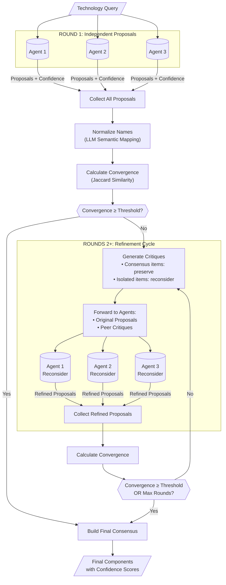

# Component Debate Process

```mermaid
flowchart TB
    subgraph Round1["ROUND 1: Independent Proposals"]
        A1[("Agent 1")]
        A2[("Agent 2")]
        A3[("Agent 3")]
    end
    
    Tech[/"Technology Query"/] --> A1
    Tech --> A2
    Tech --> A3
    
    A1 --> |"Proposals + Confidence"| Collect["Collect All Proposals"]
    A2 --> |"Proposals + Confidence"| Collect
    A3 --> |"Proposals + Confidence"| Collect
    
    Collect --> Normalize["Normalize Names\n(LLM Semantic Mapping)"]
    Normalize --> Calc["Calculate Convergence\n(Jaccard Similarity)"]
    
    Calc --> Check{{"Convergence ≥ Threshold?"}}
    
    Check --> |"Yes"| Consensus["Build Final Consensus"]
    Check --> |"No"| Critique["Generate Critiques\n• Consensus items: preserve\n• Isolated items: reconsider"]
    
    subgraph Loop["ROUNDS 2+: Refinement Cycle"]
        Critique --> Forward["Forward to Agents:\n• Original Proposals\n• Peer Critiques"]
        
        Forward --> R1[("Agent 1\nReconsider")]
        Forward --> R2[("Agent 2\nReconsider")]
        Forward --> R3[("Agent 3\nReconsider")]
        
        R1 --> |"Refined Proposals"| Collect2["Collect Refined Proposals"]
        R2 --> |"Refined Proposals"| Collect2
        R3 --> |"Refined Proposals"| Collect2
    end
    
    Collect2 --> Calc2["Calculate Convergence"]
    Calc2 --> Check2{{"Convergence ≥ Threshold\nOR Max Rounds?"}}
    
    Check2 --> |"No"| Critique
    Check2 --> |"Yes"| Consensus
    
    Consensus --> Output[/"Final Components\nwith Confidence Scores"/]
```
